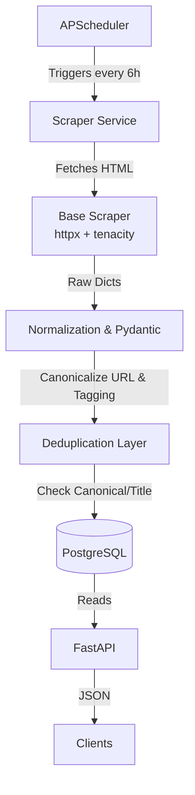

# IEEE Opportunity Intelligence System

A reliable backend system that continuously scrapes IEEE and related academic opportunity sources, normalizes the data, stores it in PostgreSQL, and exposes it through a FastAPI. 

This repository contains the **Phase 1** implementation, focusing on a robust, deterministic scraping architecture without relying on AI/LLMs.

---

## 🏗️ Architecture & Data Flow



## 🛠️ Tech Stack
- **HTTP Client**: `httpx` (async requests)
- **HTML Parsing**: `beautifulsoup4`, `lxml`
- **Resilience**: `tenacity` (exponential backoff & retries)
- **API & Validation**: `FastAPI`, `Pydantic` v2
- **Database**: `PostgreSQL` (via Docker)
- **ORM & Migrations**: `SQLAlchemy 2.0` (Async), `asyncpg`, `Alembic`
- **Scheduler**: `APScheduler`
- **Logging**: `loguru`

---

## 📁 Directory Structure

```text
project-root/
│
├── app/
│   ├── api/
│   │   └── routes/opportunities.py    # FastAPI endpoints (GET /opportunities)
│   ├── core/                          
│   ├── database/
│   │   ├── migrations/                # Alembic configuration and versions
│   │   ├── models/                    # SQLAlchemy schemas (Opportunity, ScraperRun)
│   │   └── session.py                 # Async PostgreSQL connection engine
│   ├── parsers/
│   │   ├── deduplication.py           # Logic to prevent inserting duplicate records
│   │   ├── normalization.py           # Text cleaning and summary extraction
│   │   ├── schemas.py                 # Pydantic schemas for data validation
│   │   ├── tagging.py                 # Deterministic tag extraction via keywords
│   │   └── urls.py                    # URL canonicalization (stripping UTM params)
│   ├── scheduler/
│   │   └── runner.py                  # APScheduler configuration
│   ├── scrapers/
│   │   ├── base.py                    # Abstract BaseScraper with retry logic
│   │   └── ieee_cs/cfp.py             # IEEE CS CFP Scraper implementation
│   ├── services/
│   │   └── scraper_service.py         # Orchestrates scrape -> parse -> dedupe -> save
│   └── main.py                        # FastAPI application entrypoint
│
├── scripts/
│   └── run_scraper.py                 # CLI script to test scrapers manually
├── Dockerfile                         # API Container definition
├── docker-compose.yml                 # PostgreSQL + API deployment config
├── requirements.txt                   # Python dependencies
└── alembic.ini                        # Alembic migration settings
```

---

## ⚙️ Core Components Built

### 1. The Database Layer (`app/database/models/`)
The database consists of two core tables designed for high observability:
* **`opportunities`**: Stores the normalized records. Uses a `UUID` primary key and `TIMESTAMP WITH TIME ZONE` for all dates. Tracks `last_seen_at` to determine if an opportunity is still actively listed.
* **`scraper_runs`**: An audit log table that tracks every execution of a scraper, recording `started_at`, `status`, `records_added`, `records_updated`, and any `error_message` if the run fails.

### 2. The Scraper Framework (`app/scrapers/`)
The `BaseScraper` class provides a unified interface for all future scrapers. It handles:
* Asynchronous HTTP fetching via `httpx`.
* Automatic exponential backoff and retries using `tenacity` (handling timeouts and HTTP errors gracefully).
* Standardized User-Agent headers.

### 3. Normalization & Deduplication (`app/parsers/`)
Before any data is saved, the system passes it through a strict deterministic pipeline:
1. **Validation**: Enforced via Pydantic (`OpportunityCreate`).
2. **Canonicalization**: `urls.py` strips `utm_*` tracking parameters and trailing slashes so `https://example.com/?utm_source=twitter` becomes `https://example.com`.
3. **Summarization**: Extracts the first meaningful `<p>` tag natively without relying on expensive LLM calls.
4. **Tagging**: Uses predefined regex keyword dictionaries to auto-tag opportunities with categories like `ai`, `robotics`, `grant`, `undergraduate`.
5. **Deduplication**: Checks PostgreSQL for an existing opportunity matching either the `canonical_url` OR the exact combination of `normalized_title` and `organization`.

### 4. The Orchestrator (`app/services/scraper_service.py`)
This is the heart of the ETL process. It instantiates a scraper, opens a database session, tracks the run in `scraper_runs`, loops through the raw dictionary results, passes them through the normalization layers, and performs an `INSERT` (if new) or `UPDATE` (if it already exists, updating `last_seen_at`).

### 5. API & Scheduler (`app/main.py`)
* **FastAPI**: Provides a `GET /opportunities` endpoint that supports pagination, category filtering, and organization filtering.
* **APScheduler**: Hooks into the FastAPI `lifespan` event. Upon server startup, it spins up an async background scheduler that triggers the `ieee_cs_cfp` scraper every 6 hours automatically.

---

## 🚀 How to Run Locally

### Prerequisites
- Docker & Docker Compose
- Python 3.12+

### 1. Setup Environment
```bash
# Activate the virtual environment
source venv/bin/activate
```

### 2. Start PostgreSQL
```bash
# Start the database container
docker-compose up -d db

# Apply schema migrations
alembic upgrade head
```

### 3. Run the Application
You can run a single scraper manually to test the pipeline:
```bash
python scripts/run_scraper.py
```

Or you can start the full FastAPI server (which also starts the automated background scheduler):
```bash
uvicorn app.main:app --reload
```

* The API will be available at: `http://localhost:8000`
* Interactive Documentation: `http://localhost:8000/docs`
